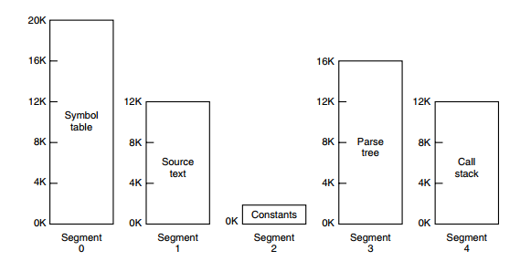

# 操作系统常见知识点 #

参考资料：

- 《操作系统》清华大学(向勇、陈渝) ，在线课程

- github：frank-lam/2019_campus_apply

# 一、操作系统的基本特征 #

# 二、进程与线程 #

  
 

## 1.进程 ##

**进程是资源分配的基本单位**，用来管理资源(例如：内存、文件、网络等资源)。

进程是指一个具有一定独立功能的程序在一个数据集合上的一次动态执行的过程，包含正在运行的一个程序的所有状态信息，动态性，并发性，独立性以及制约性。

进程控制块(PCB)：进程标识信息，处理机现场保存，进程控制信息。**PCB是描述进程的数据结构。**

下图显示4个程序创建4个进程，这四个进程可以并发执行。

  
 

进程的状态：创建，执行，等待，抢占，唤醒，结束。

## 2.线程 ##

**线程是独立调度的基本单位。**

线程是进程的一部分，描述指令流执行状态，它是进程中的指令执行流的最小单元，是CPU调度的基本单位，多个线程之间可以共享资源。

例：QQ和浏览器是两个进程，浏览器进程里面有很多线程，例如HTTP请求线程、渲染线程等等，线程的并发执行使得浏览器中点击一个新链接从而发起HTTP请求时，浏览器还可以响应用户的其它事件。

## 3进程和线程的区别 ##

**1. 拥有资源**：进程是资源分配的基本单位，线程不拥有资源，但可以访问线程隶属的进程资源。

**2. 调度：**线程是独立调度的基本单位，在同一进程中，线程之间的切换不会引起进程切换，从一个进程内的线程切换到另一个进程中的线程时，会引起进程切换。

**3.系统开销：**进程的创建和撤销，系统需要为之分配或回收资源，如内存空间、I/O设备等，其所付出的开销远大于创建或撤销线程时的开销。同样地，在进行进程切换时，需要对当前执行进程CPU环境的保存，以及对新调度进程CPU环境的设置，而线程切换时，只需要保存和设置少量寄存器内容，开销很小。

**4.通信方面**：进程间的通信需要进程同步和互斥手段的辅助，保证数据的一致性。而线程间可以通过直接读/写同一进程中的数据段(如全局变量)来进行通信。

## 2.线程的同步方式 ##

进程同步是指多个进程按照一定顺序执行，进程通信是指信息传输。

**互斥**：一个进程占用资源，其他**进程不能使用**。
**死锁**：多个进程各占用部分资源，形成**循环等待**。
**饥饿**：其他进程轮流占用资源，一个进程一直**得不到资源**。

1.互斥量：采用互斥对象机制，只有拥有互斥对象的线程才有访问公共资源的权限。因为互斥对象只有一个，所以可以保证公共资源不被多个线程同时访问。

2.信号量：它允许同一时刻多个线程访问同一资源，但是需要控制同一时刻访问此资源的最大线程数量。当需要一个计数器来限制可以使用某共享资源的线程数目时，可以使用信号量对象。

3.事件(信号):通过通知操作的方式保持多线程同步，还可以方便的实现多线程的优先级的比较操作。即事件机制允许一个线程在处理完一个任务后，主动唤醒另一个线程执行任务。

### 经典的同步问题 ###

#### 1.读者--写者问题####

允许多个进程同时对数据进行读操作，但是不允许读和写以及写和写操作同时发生。

一个整型变量count记录在对数据进行读操作的进程数，一个互斥量count_mutex用于对count加锁，一个互斥量data_mutex用于对读写的数据加锁。

    typedef int semaphore;
    semaphore count_mutex = 1;//对count加锁
    semaphore data_mutex = 1;//对读写数据加锁
    int count = 0;//共享数据
    
    void reader() {
    while(TRUE) {
        down(&count_mutex);
        count++;
        if(count == 1) down(&data_mutex); // 第一个读者需要对数据进行加锁，防止写进程访问
        up(&count_mutex);
        read();
        down(&count_mutex);
        count--;
        if(count == 0) up(&data_mutex);
        up(&count_mutex);
    }
    }
    
    void writer() {
    while(TRUE) {
        down(&data_mutex);
        write();
        up(&data_mutex);
    }

    }

#### 2.哲学家就餐问题####
当所有哲学家同时拿起左边筷子时，会造成死锁。那么如何避免死锁？
- 1.必须同时拿起左右筷子。
- 2.只有左右两个邻居都没有进餐的情况下才允许进餐。

## 3.进程的通信方式 ##

进程通信是进程进行同步的机制。

- 进程同步：控制多个进程按一定顺序执行。
- 进程通信：进程间传输信息。

**1.管道**

管道是通过调用pipe函数创建的，fd[0]用于读，fd[1]用于写。

    #include <unistd.h>
    int pipe(int fd[2]);

**限制条件：**

- 只支持半双工通信(单向交替传输)。
- 只能在父子进程中使用。

  
 

**2.FIFO**

也称为命名管道，改善了管道只能在父子进程使用的限制。

    #include <sys/stat.h>
    int mkfifo(const char *path, mode_t mode);
    int mkfifoat(int fd, const char *path, mode_t mode);
FIFO常用于客户-服务器程序中，FIFO用作汇聚点，在客户进程和服务器进程之间传递数据。

  
 

**3.消息队列**

相比于FIFO，消息队列具有以下优点：

- 消息队列可以独立于读写进程存在，从而避免了FIFO中同步管道的打开和关闭时可能产生的困难；
- 避免了FIFO的同步阻塞问题，不需要进程自己提供同步方法。
- 读进程可以根据消息类型有选择的接收消息，而不像FIFO那样只能默认地接收。

**4.信号量**

它是一个计数器，用于为多个进程提供对共享数据对象的访问。

**5.共享存储**

允许多个进程共享一个给定存储区。因为数据不需要在进程间复制，所以这是进程通信最快的一种方式。但是需要借助**4.信号量**用来同步对共享存储的访问。

多个进程可以使用同一个文件映射到它们的地址空间来实现共享内存。

**6.套接字**

可用于不同机器之间的进程通信。

**通信方式**

**间接通信**：通过内核进行通信。通过操作系统维护的**消息队列**实现进程间的消息接收和发送：1.每个消息队列都有一个唯一的标识，2.只有共享了相同的消息队列的进程才能通信。通信链路的属性：1.只有共享了**相同消息队列**的进程，才能建立连接。2.连接可以是单向或双向3.消息队列可以与多个进程相关联。4.每对进程可以共享多个消息队列。

间接通信的流程：1.创建一个新的消息队列，2.通过消息队列发送和接收消息3.销毁消息队列。

**直接通信**：线程之间通过共享信道进行通信。进程必须正确的命名对方，**通信链路的属性:**1.自动建立链路，2.一条链路恰好对应一对通信进程，3.每对进程之间只有一个链路存在，4.通信链路可以是单向也可以是双向的。

间接通信与直接通信的通信操作的区别是直接通信关注的是**接收和发送的进程**，而间接通信**关注的是消息队列**。

进程通信可以划分为阻塞和非阻塞通信，阻塞通信：1.阻塞发送：发送者在发送消息后进入等待，知道接受者成功接收 2.阻塞接收：接收者在请求接收消息后进入等待，直到成功收到一个消息。非阻塞通信：1.非阻塞发送：发送者在消息发送后，可立即进行其他操作。2.非阻塞接收:没有消息发送时，接收者在请求接收消息之后，接收不到任何消息。

通信链路缓冲：1.0容量：发送方必须等待接收方。2.有限容量：通信链路缓存队列满时，发送方必须等待。3.无限容量：发送方不需要等待。

**通信机制**

**1.信号**：进程间软件中断通知和处理机制。信号的接收处理：1.捕获，执行进程指定的信号处理函数别调用。2.忽略，执行操作系统指定的缺省处理。3.屏蔽：禁止进程接收和处理信号。确定：信息传输量小

**2.管道**:进程间基于内存文件的通信机制，子进程从父进程继承文件描述符，缺省文件描述符：0 stdin,1 stdout,2 stderr。
与管道相关的系统调用，读管道：read(fd,buffer,nbytes),scanf()是基于它实现的。写管道：write(fd,buffer,nbytes），printf()是基于它实现的。创建管道:pipe(rgfd)，rgfd是两个文件描述符组成的数组，rgfd[0]是读文件描述符。rgfd[1]是写文件描述符。

**3.消息队列：**消息队列是由操作系统维护的以字节序列为基本单位的间接通信机制
1.每个消息是一个字节序列。
2.相同标识的消息组成按先进先出顺序组成一个消息队列。

**4.共享内存**
共享内存是把同一个物理内存区域同时映射到多个进程的内存地址空间的通信机制。
进程：1.每个进程都有私有内存地址空间。2，每个进程的内存地址空间需明确设置共享内存段。
线程：同一进程中的线程总是共享相同的内存地址空间。速度快，需要加**同步机制**。
## 4.进程有哪几种状态 ##

创建,执行，等待，抢占,唤醒，结束。

  
 

三状态进程模型：运行状态，就绪状态，等待状态。辅佐状态：创建和退出

- 就绪状态(ready)：等待被调度。
- 运行状态(running):
- 阻塞状态(waiting):等待资源。

**注意一下几点：**

- 只有就绪状态和运行状态可以相互转换，其它都是单向转换。就绪状态的进程通过调度算法获得CPU时间，转为运行状态；而运行状态的进程，在分配给它CPU时间片用完之后就转为就绪状态，等待下一次调度。
- 阻塞状态是缺少需要的资源从而由运行状态转换而来，但是该资源不包括CPU资源时间，缺少CPU时间会从运行转换为就绪状态。
- 进程只能自己阻塞自己，因为只有进程自身才知道何时需要等待事件的发生。

## 5.进程调度策略 ##

## 1.批处理系统 ##

## 1.1先来先服务(FCFS) ##
按照请求的顺序进行调度。有利于长作业，但不利于短作业，因为短作业必须等待前面的长作业执行完毕才能执行而长作业又需要执行很长时间，造成了短作业等待时间过长。

## 1.2短作业(进程)优先调度算法 ##
按照估计运行时间最短的顺序进行调度。

这种算法可能会导致长作业饿死，处于一直等待短作业执行完毕的状态，因为如果一直有短作业到来，那么长作业永远得不到调度。

## 1.3 最短剩余时间优先 ##
按照剩余时间最短进行调度。

## 2.交互式系统 ##
## 2.1 时间片轮转 ##
将所有就绪进程按照FCFS原则排成一个队列，每次调度是，把CPU时间分配给队首进程，该进程可以执行一个时间片。当时间片用完时，由计时器发出时钟中断，调度程序便停止该进程的执行，并将它送往就绪队列的末尾，同时将CPU的时间分配给队首的进程。

**时间片轮转算法的效率和时间片的大小有很大关系：**

- 因为进程切换都要保存进程的信息并且载入新进程的信息，如果时间片太小会导致进程切换太频繁。
- 如果时间片过长，那么实时性就得不到保障。

  
 

## 2.2 优先级调度算法 ##

为每个进程分配一个优先级，按优先级进行调度。为了防止低优先级的进程永远得不到调度，可以随着时间的推移增加等待进程的优先级。

## 2.3 多级反馈队列 ##

一个进程需要执行100个时间片，如果采用时间片轮转调度算法，那么需要交换100次。多级队列是为了这种需要连续执行多个时间片的进程考虑，它设置了多个队列，每个队列时间片大小都不同，例如1，2，4，8.。进程在第一个队列没执行完，就会被移动到下一个队列。这种方式下，之前的进程只需要交换7次。

每个队列优先权不同，最上面的优先权最高。因此只有上一个队列没有进程在排队，才能调度当前队列上的进程，可以将这种调度算法看成**时间片轮转调度算法和优先级调度算法**的结合。

  
 

## 3.实时系统 ##

实时系统要求一个请求在一个确定时间内得到响应。
分为硬实时和软实时，前者必须满足绝对的截止时间，后者可以容忍一定的超时。

# 三、死锁 #

## 6.什么是死锁？死锁产生的条件 ##
死锁是指由于**竞争资源**或者**通信关系**，两个或更多线程在执行中出现，永远相互**等待**只能有其他进程引发的事件。

  
 

死锁产生的条件：
1.互斥：任何时候只能有一个进程使用一个资源的实例,每个资源要么已经分配给了一个进程，要么就是可用的。
2.持有并等待：进程保持至少一个资源，并正在等待获取其他进程持有的资源
3.非抢占：资源只能在进程使用后自愿释放，不能被强制性抢占。
4.循环等待：存在等待进程集合，有两个或两个以上的进程组成一条死路，该环路中的每个进程都在等待下一个进程所占有的资源。。

## 7.死锁的基本策略和常用方法 ##
有应用进程处理死锁，操作系统则忽略死锁。
###1.鸵鸟策略。###

在发生死锁，对用户不造成很大影响时，忽视死锁。大多数操作系统采用这种方法。

###2.死锁检测和恢复###

在检测到运行系统进入死锁状态后，进行恢复。

**死锁检测算法**是通过检测有向图是否存在环来实现，从一个节点出发进行深度优先搜索，对访问的结点进行标记，如果访问到已经标记的节点，就表示有向图存在环，也就是检测到死锁发生。
**死锁恢复：**1.利用抢占恢复；2.利用回滚恢复，3.通过杀死进程恢复。

###3.死锁预防###

确保系统永远不会进入死锁状态。

1.破坏互斥条件：允许多个进程同时输出。
2.破坏占有和等待条件：所有进程在开始执行前请求所需要的全部资源。
3.破坏不可抢占条件:允许进程强行从占有者那里夺取资源
4.破坏环路等待条件：给资源进行统一编号，进程只能按编号顺序请求资源。

###4.死锁避免###
在使用前进行判断，只允许不会出现死锁的进程请求资源。

####1.安全状态
####2.银行家算法

# 四、内存管理 #

## 1.虚拟内存 ##

虚拟内存的目的是为了让物理内存扩充成逻辑内存，从而让程序获得更多的内存空间。

为了更好的管理内存，操作系统将内存抽象成地址空间。每个程序拥有自己的地址空间，这个地址空间别分割成多个块，每一块称为一页。这些页被映射到物理内存，但不需要映射到连续的物理内存，也不需要所有页都必须在物理内存中。当程序引用到一部分不在物理内存中的地址空间时，由硬件执行必要的映射，将缺失的部分装入物理内存并重新执行失败的指令。

从上面的描述中可以看出，虚拟内存允许程序不用将地址空间中的每一页都映射到物理内存，也就是说一个程序不需要全部调入内存就可以运行，这使得有限的内存运行大程序成为可能。例如下图所示，一台可以产生16位地址，那么一个程序的地址空间范围0~64K。该计算机只有32K内存，虚拟内存技术允许该计算机运行一个64K大小的程序。

  
 

## 2.分页系统地址映射 ##

- 内存管理单元：管理着地址空间和物理内存的转换。
- 页表：页(地址空间)和页框(物理内存空间)的映射表

在下图中，页表的第0个表项为010，表示第0个页映射第2个页框。页表项的最后一位用来标记页是否在内存中。图中页表存放16个页，这16个页需要4个比特位进行索引定位。因此对于虚拟地址(0010 000000000100),前4位用来存储页面号，而后12位存储在页中偏移量。(0010 000000000100)根据前4位得到页号为2，读取表项内容为(110 1)，它的前3位为页框号，最后一位表示该页在内存中。最后映射的物理地址为(110 000000000100)。

  
 
## 3.页面置换算法 ##

###1.最佳

所选择的被换出的页面将是最长时间内不再被访问，通常可以保证或得最低的缺页率。是一种理论的算法，因为无法知道一个页面多长时间不再被访问。

例如：一个系统为某进程分配三个物理块，并有如下页面引用序列：

                 701203042
开始运行时，先将7,0,1三个页面装入内存。当进程要访问页面2时，产生缺页中断，会将页面7换出，因为页面7再次被访问时间最长。

###2.最近最久未使用

虽然无法知道将来要使用页面情况，但是可以知道过去使用页面的情况。LRU将最近最久未使用页面换出。为了实现LRU，需要在内存中维护一个**链表**。当一个页面被访问时，将这个页面移到**链表表头。**这样就能保证**链表表尾的页面是最近最久未访问的**。

由于每次都需要更新链表，因此这种方式实现的LRU代价很高。

  
 

### 3.最近未使用 ###

每个页面都有两个状态位：R与M，当页面被访问的时候R=1，当页面被修改时M=1。其中R位会被定时清零。可以将页面分成以下四类：

- R=0,M=0
- R=0,M=1
- R=1,M=0
- R=1,M=1

当页面发生中断时，NRU算法随机地从类编号最小的非空类中挑选出一个页面将他换出。NRU优先换出已经被修改的脏页面(R=0,M=1)，而不是频繁的使用干净的页面(R=1,M=0)。

###4.先进先出

选择换出的页面是最先进入的页面。由于该算法会将经常访问的页面换出，所以缺页率较高。

###5.第二次机会算法
由于FIFO算法可能会将经常访问的页面置换出去，为了避免这个问题，进行修改，当页面被访问时设置该页面的R位为1。需要替换的时候，检查老页面的R位，如果R位是0，那么这个页面既老又没有别使用，可以被置换；如果R=1，将R清0，并把该页面放到链表的尾端，修改它的装入时间就像它刚刚被装入一样，然后继续从链表的头部开始搜索。

  
 

###6.时钟

第二次机会算法需要在链表中移动页面，降低了效率。时钟算法使用环形链表将页面连接起来，再使用一个指针指向最老的页面。

  
 

### 7.局部页面置换算法的比较

- LRU算法性能比较好，但系统开销较大
- FIFO算法系统开销较小，会出现Belady现象
- Clock算法是她们的折衷

页面访问时，不动态调整页面在链表中的顺序，仅做标记。

缺页时，再把它移动到链表末尾。

- 对于未被访问的页面，Clock和LRU算法的表现一样好
- 对于被访问的页面，Clock算法不能记录准确访问的顺序，而LRU算法可以。

### 8.全局置换算法

- 1.工作集置换算法
- 2.缺页率置换算法
- 3.抖动和负载控制

### 9.非连续内存分配 ##

段式存储管理(大)

页式存储管理(小)

页帧：把物理地址划分为大小相同的基本分配单位，2的N次方。

页面：把逻辑地址空间划分为大小相同的基本分配单位，帧和页的大小必须是相同的。

页面到页帧的转换：1.从逻辑地址到物理地址的转换 2.页表 3.MMU/TLB

### 10.分页与分段的区别 ##

1.页是信息的物理单位，分页是为了实现离散分配方式，以消减内存的外零头，提高内存的利用率。段则是信息的逻辑单位，它含有一组其意义相对完整的信息。分段的目的是为了更好的满足用户的需要。

2.页的大小固定且由系统决定；而段的长度却不固定，决定于用户所编写的程序。

3.分页的地址空间是一维的，程序员只需要利用一个记忆符，即可表示一个地址；而分段的作业地址空间是二维的，程序员在标识一个地址时，既需要给出段名，又需要给出段内地址。

## 4.分段 ##

虚拟内存采用的是分页技术，也就是将地址空间划分成固定大小的页，每一页再与内存进行映射。下图为一个编译器在编译过程中建立的多个表，有4个表是动态增长的，如果使用分页系统的一维地址空间，动态增长的特点会导致覆盖问题的出现。

  
 

分段的做法是把每个表分成段，一个段构成一个独立的地址空间。每个段的长度可以不同，并且可以动态增长。

  
 

## 5.段页式 ##

程序的地址空间划分成多个拥有独立地址空间的段，每个段上的地址空间划分成大小相同的页。这样既拥有分段系统的共享和保护，又拥有分页系统的虚拟内存功能。

## 6.分页和分段的比较 ##

1. 对程序员的透明性：分页透明，但分段需要程序员显示划分每个段。
2. 地址空间维度：分页是一维空间，分段是二维。
3. 大小是否可变：页的大小不可变，段的大小可以动态改变。
4. 出现的原因：分页主要用于实现虚拟内存，从而获得更大的地址空间；分段主要是为了程序和数据可以被划分为逻辑上独立的地址空间并且有助于共享和保护。

# 五、设备管理 #

## 1.磁盘结构 ##

## 2.磁盘调度算法 ##

## 1.先来先服务 ##
> FCFS:First Come First Served

## 2.最短寻道时间优先 ##
> SSTF:Shortest Seek Time First

## 3.电梯算法 ##

# 六、链接 #

## 编译系统 ##

利用一个hello.c的程序说明

    #include <stdio.h>

    int main()
    {
       printf("hello, world\n");
       return 0;
    }

在Unix系统上，由编译器把源文件转化为目标文件。执行以下命令：

    gcc -o hello hello.c
其实际过程如下图所示：

  
 

- 预处理阶段：处理以#开头的预处理命令，hello.c文件转化为hello.i文件；

        $ gcc -E hello.c -o hello.i

- 编译阶段：编译(ccl)器将文本文件翻译成汇编文件，hello.i文件转化为hello.s文件.它包含一个汇编语言程序；

        $ gcc -S hello.i -o hello.s

- 汇编阶段(as)：编译器(as)将hello.s翻译成机器码，将汇编文件转化为可重定向目标文件,hello.s文件转化为hello.o文件；

        $ as hello.s -o hello.o

- 链接阶段：printf函数是标准c库的一个函数，在printf.o这个单独单独编译好的目标文件中，连接器将重定向目标文件hello.o和printf.o合并，得到hello可执行目标文件。

        $ gcc hello.o -o hello