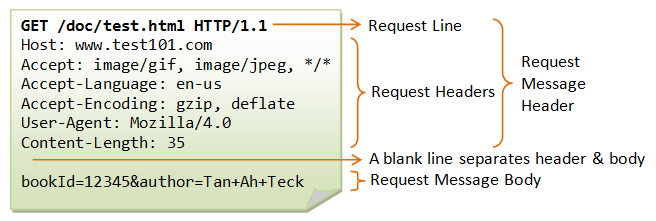
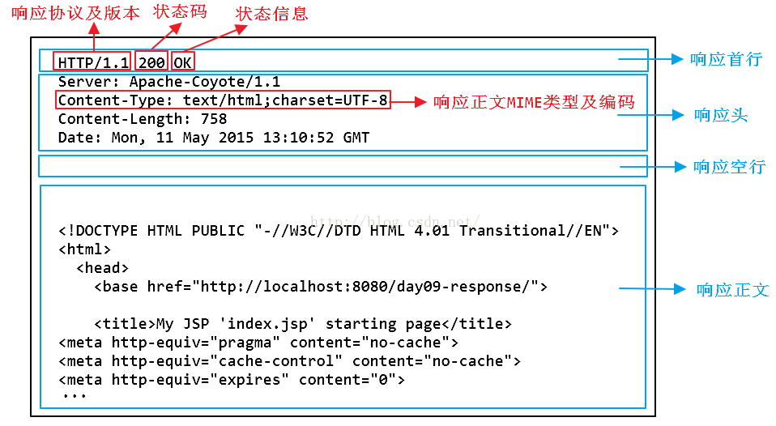

# 网络分层与各层协议 #
OSI7层模型：1.物理层,2.数据链路层,3.网络层,4.传输层,5.会话层,6.表示层,7.应用层

TCP/IP 4层模型:1.网络接口层,2.运输层,3.网际层,4.网络接口层

五层协议：1.物理层，2.数据链路层，3.网络层，4.运输层，5.应用层。

  
 

应用层：域名系统DNS，万维网应用HTTP协议，发电子邮件SMTP协议，收邮件协议POP3，文件传输协议FTP。
运输层：传输控制协议TCP,用户数据协议UDP。报文段。      
网络层:IP协议。IP数据报。ARP、ICMP协议。包。     
数据链路层：封装成帧。  
物理层：数据单元为比特。

# 一、应用层 #
## HTTP协议 (超文本传输协议)

## 1.URL、URI、URN的区别 ##

- URI(统一资源标识符，web服务器资源的名字，例如：index.html)
- URL(统一资源定位符)
- URN(统一资源名称)

实际上URI包括URL、URN，目前只有URL比较流行，所以见到的基本都是URL。

## 2.HTTP的请求和响应报文 ##

**（1）请求报文**

  
 

HTTP请求由请求行、请求头、空行、请求数据4个部分组成，而请求行又包括请求方法字段、请求的URL地址、协议名称及版本组成。

**GET请求**

  
 

GET方式是最常见的一种请求方式。我们日常点击链接或者通过浏览器浏览网页，就是使用GET方式。GET方法要求服务器将URL定位的资源放在响应报文数据部分，回送到客户端。

**POST请求**

  
 

**（2）响应报文**

  
 

HTTP响应报文也由三个部分组成，分别是：状态行、消息报头、响应正文。

**200响应**

  
 

**404响应**

  
 

## 3.HTTP状态码 ##
- 1xx:指示信息--请求已经接受，正在处理。
- 2xx:成功--请求正常接收完毕。
- 3xx:重定向--需要进行附加操作以完成请求。
- 4xx:客户端错误--请求语法错误或者请求无法实现。
- 5xx:服务端错误--服务器处理请求出错。

  
 

**HTTP的常见状态码 **

- 200 OK
- 301 永久移除
- 400 Bad Request
- 404 Not Found
- 505 HTTP Version Not Surpported

**无状态**：服务器不维护任何有关客户端过去所发请求的信息。

使用TCP传输服务：

服务器在80端口等待客户请求

浏览器发起到服务器的TCP连接（创建套接字Socket）

服务器接受来自浏览器的TCP连接

浏览器（HTTP客户端）与Web服务器（HTTP服务器）交换HTTP消息

关闭TCP连接

**HTTP1.0使用非持久性连接，每个TCP连接最多允许传输一个对象
HTTP1.1使用持久性连接，每个TCP连接允许传输多个对象**

HTTP协议有两类消息：请求消息(request)和响应消息(response)

**HTTP请求**

1.请求行：
请求方式：POST、GET
请求资源
协议版本

2.请求头：
客户端发给服务器端的一些信息。使用键值对表示key:value

3.请求体
当请求方式使post时，格式：username=zhangsan&password=123
如果请求方式为get，那么请求参数不会出现在请求体中。会拼接在URL地址后面
http://localhost:8080...?username=zhangsan&password=123

**HTTPS **

HTTP+SSL(TLS)
HTTPS在传输数据之前需要客户端与服务器进行一个握手(TLS/SSL握手)，在握手过程中将确立双方加密传输数据的密码信息。

## 4.HTTP长连接、短链接 ##

在HTTP/1.0中默认使用短链接，即客户端与服务器每进行一次HTTP操作，就建立一次连接，任务结束就中断连接。

从HTTP/1.1开始，默认使用长连接，用来保持连接性，使用长连接的HTTP协议，会在响应头加入下面的代码：
    
    Connection:keep-alive

在使用长连接的情况下，当一个网页打开完成之后，客户端与服务端之间用于传输HTTP数据的TCP连接不会关闭，客户端再次访问这个服务器时，会继续使用这一条已经建立的连接。Keep alive不会永久保持，可以在不同服务器中设定时间。

## 5.Cookie和Session ##
**Cookie**
Cookie是服务端发送到用户浏览器并保存到本地的一小块数据，它会在浏览器再次向同一服务器发起请求时被携带并发送到服务器上。它用于告诉服务端两个请求是否来自同一浏览器，并保持用户登录状态。

**Seesion**
用户信息也可以存储到服务器中，这样更加安全。比如存储在服务器上的数据库或者Redis或者其他文件中。

Session维护用户登录的过程：

- 用户登录时，用户提交包含用户名和密码的表单，放入HTTP请求报文中；
- 服务器验证用户名和密码；
- 如果正确则把用户信息存储到Redis中，此时Redis中的ID叫做 Session ID；
- 服务器返回的响应报文的Set-Cookie首部字段包含了这个Session ID，客户端收到响应报文之后将该Cookie值存入浏览器；
- 客户端之后对同一个服务器进行请求时会包含该Cookie值，服务器收到之后提取Session ID，从Redis中取出用户信息，继续之后的业务操作。

  
 

# 二、传输层 #

传输层提供进程间的逻辑通信，其向高层用户屏蔽下面网络层的核心细节，是应用程序看起来像是两个传输层实体进行端到端的通信。

## TCP ##
- 面向连接：客户机/服务器进程间需要建立连接
- 可靠的传输
- 只能一对一
- 面向字节流(流入到进程或流出进程的字节流)
- 流量控制：发送方不会发送速度过快，超过接收方的处理能力
- 拥塞控制：当网络负载过重时能够限制发送方的发送速度
- 全双工通信

  
 

TCP首部前20字节是固定的，后面的4N字节是根据需要增加的选项。

- 源端口和目的端口：各占2个字节。
- 序号：占4个字节，用于对字节流进行编号，若序号为301，表示表示当前报文段的第一个字节序号为301，如果数据长度为100字节，则下一个报文段的序号为401。
- 确认号：占4个字节，期望收到的下一个报文段的序号。若B正确接收A发送来的一个报文段，序号是501，数据长度为200字节，那么B期望下一个报文段的序号为701，那么B发送给A的确认报文段中确认号为701。
- 数据偏移：占4位，该字段实际只首部的长度，但由于存在不确定字段，所以数据偏移字段是需要的，其单位是32位字(即4字节)。
- 保留：占6位。
- URG：紧急数据位，当置为1时，说明有紧急数据需要传。
- ACK：当ACK=1时，确认号字段才有效，在建立连接后，所有报文段的ACK都必须置为1。
- PSH:当PSH为1时，会立即创建一个报文段发出去。
- RST：当RST=1时，表明TCP连接中出现严重差错，必须释放连接，他可以用来拒绝一个非法报文段或拒绝一个连接。
- SYN：在建立连接时，当SYN=1,ACK=0时表示这是一个连接请求报文段，若对方同意建立连接，则响应报文中SYN=1,ACK=1。
- 终止FIN，用来释放一个连接，当FIN=1时，表名此报文段的发送方的数据已经发送完毕，并要求释放运输连接。
- 窗口：窗口值作为接收方让发送方设置其发送窗口的依据。
- 校验和：占2个字节，与UDP类似，UDP协议号为17，TCP协议号为6，长度需要修改。
- 紧急指针：当URG=1时有效。

**三次握手**

  
 

- 客户端A主动打开连接，服务端B被动打开连接。
- 服务端B的TCP服务器先创建传输控制块(TCB),服务器进程进入监听(listen)状态，等到客户端A的连接请求。
- 客户端A也创建TCB，并向服务端发送请求报文，SYN置为1，并初始化一个序号seq=x。
- 服务端接收连接请求，如果确认连接，发送响应报文，SYN=1,ACK=1,由于客户端的序列号消耗一位序号，服务端B的确认号为ack = x+1，并初始化一个序号y。
- 客户端A接收服务端B的确认之后，还要想服务端B发出确认报文，SYN=1,ACK=1,由于服务端B也要消耗一个序号，所以A的确认号ack=y+1，序号seq=x+1。

**为什么TCP连接需要三次握手？两次不可以吗？**

为了防止已经失效的连接请求报文突然又传到服务端。根据上述例子，假定一种情况：当A发出的第一个请求因为网络节点的时间滞留，以致于等到第二个连接释放以后才到达B，那么误以为A再次发出连接请求，重新建立新的连接，将一直等待客户端发送数据，白白浪费服务器资源。采用三次握手时，需要客户端再次发送确认，所以可以避免再次建立连接。

- 客户端-发送带有SYN标志的数据包--一次握手--服务端
- 服务端-发送带有SYN/ACK标志的数据包--二次握手--客户端
- 客户端-发送带有ACK标志的数据包--三次握手--服务端

第一次握手：服务端确认客户端发送正常  
第二次握手：客户端确认自己发送、接收正常，服务端发送、接收正常；服务器确认自己接收正常，客户端发送正常。
第三次握手：客户端确认自己发送接收正常，服务器发送接收正常；服务器确认自己发送接收正常。

**四次挥手**

  
 

- 客户端A先想服务端B发送释放连接请求，FIN=1,序号seq=u等于A前面已经传送过的报文最后一个字节序号加1,停止发送数据，并主动关闭连接。A进入FIN-WAIT-1，等待B的确认。
- B收到连接释放请求后发出确认报文，确认号ack=u+1，自己的序号为v等于B前面已经传送过的数据的最后一个字节的序号加1，B进入CLOSE_WAIT(关闭等待状态)。TCP服务这是通知高层应用进程，A->B连接已经释放。(半关闭状态)
- A收到B的确认之后就进入FIN-WAIT-2状态，等待B发出释放连接请求。
- B发出释放连接报文段FIN=1,假定序号为w，确认号还是之前的u+1,B进入LAST-ACK状态，等待A的确认。
- A在收到B的连接释放报文后，必须对此发出确认，ACK=1,seq=u+1,ack=w+1;随后进入TIME_WAIT状态，等待2MSL(2*2=4mins)时间后释放连接。
- B收到A的确认报文段后，释放链接。

**为什么需要2MSL(最长报文段寿命)？**
1. 确保最后一个确认报文段能够到达服务端B，如果B没有手段A的确认报文段，将重新发送连接释放请求，在A等到的时间段内可以重传。
2. A等待一段时间是为了让本连接中产生的所有报文都从网络中消失，使得下一个连接不会出现旧的报文。
**四次挥手的原因**
前两次只能保证A->B的连接释放，服务端可能还会发送数据，在服务端进入CLOSE_WAIT状态之后，服务端也需要发送释放请求并得到客户端的确认。

- 客户端-发送一个FIN，用来关闭客户端到服务端的数据
- 
- 服务器-收到一个FIN，它发回一个ACK，确认序号为收到的序号加1.和SYN一样，一个FIN将占用一个序号。
- 服务器-关闭与客户端的连接，发送一个FIN给客户端
- 客户端-发回ACK报文确认，并将确认序号设置为收到序号加1

**保活计数器**

当客户端主机出现故障时，服务器不能一直等待下去。服务器每收到一次客户数据，就重新设置保活计数器，时间的设置通常是两个小时。若两个小时没有收到客户端的数据，服务器就发送一个探测报文段，以后每个75分钟在发送一次，若一连发送10个探测报文段后仍无客户端响应，服务器就认为客户端出现故障，接着关闭这个连接。

**滑动窗口**

窗口是缓存的一部分，用来暂时存放字节流。发送方和接收方各有一个窗口，接收方通过TCP报文段中的窗口字段告诉发送方自己的窗口大小，发送方根据这个值和其他信息设置自己窗口的大小。

发送窗口内的字节都允许被发送，接收窗口内的字节都允许被接收。如果发送窗口左边的字节已经发送并且收到了确认，那么就将发送窗口向右滑动一定距离，直到左部第一个字节不是已经发送并且已确认的状态；接收窗口同理当左部字节已经发送确认并交付主机，就向右滑动窗口。

  
 

接收窗口只会对窗口内最后一个按序到达的字节进行确认，例如接收窗口已经收到字节为{31,34,35},其中{31}按序到达，而{32，33}没有按序到达，因此只对31进行确认。发送得到一个字节的确认之后，就知道该字节之前的所有字节都已经被接收。

**下面进行滑动窗口模拟**
在TCP中，滑动窗口是为了流量控制。如果对方发送数据过快，接收方就来不及接收，接收方就需要通告对方，减慢数据的发送。

  
 

**流量控制**

流量控制是为了控制发送方发送速率，保证接收方来得及接收。

接收方发送的确认报文中的窗口字段可以用来控制发送方窗口大小，从而影响发送的发送速率。

利用滑动窗口可以方便的在TCP连接基础上实现对发送方的流量控制。

**拥塞控制**

拥塞是指网络中对某一资源的需求大于可用资源。

如果网络出现拥塞，分组将会丢失，此时发送方会继续重传，从而导致网络拥塞程度更高。因此出现拥塞时，应当控制发送方的速率，这一点和流量控制很像，但是出发点不同。流量控制是为了让接收方能来得及接收，而拥塞控制是为了降低整个网络的拥塞程度。

  
 

TCP主要通过四种算法来进行拥塞控制：慢开始、拥塞避免、快重传、快恢复。

**拥塞窗口与发送方窗口的区别**：拥塞窗口只是一个状态变量，实际决定发送方能发送多少数据的是发送方窗口。

**慢开始与拥塞避免**

  
 

发送方最初执行慢开始，令cowd=1,发送方只能发送一个报文段；当收到确认后，将cwnd加倍，按照这个规律，之后发送方能够发送报文段数量为：2，4，8...。

按照慢启动的规律，cwnd呈指数加倍增长，由于快速增长，网络拥塞可能也就更高。所以可以设定一个慢启动阈值ssthresh,当cwnd >= ssthresh时，进入拥塞避免，每次轮次只将cwnd加1。

如果出现超时，则令ssthresh = cwnd/2,然后重新执行慢开始。

**快重传与快恢复**

**快重传**

  
 

在接收方，要求每次接收到报文段都应该对最后一个已收到有序报文段进行确认。如上图所示，接收到M1,M2，此时收到M4，应该发送对M2的确认。

在发送方，如果收到三个重复确认，不必等到重传计时器到期，那么就可知道下一个报文段丢失。此次立即执行快重传，重传下一个报文段。例如上图收到三个M2的确认(三个重复确认),则可以判断M3缺失，立即重传M3。

**快恢复**

  
 

在上述情况下，只是丢失个别报文，而不是网络拥塞，因此执行快恢复，令ssthresh = cwnd/2,cwnd = ssthresh,注意到此时直接进入拥塞避免。

注意：慢开始和快恢复的快慢指的是cwnd的设定值，而不是cwnd的增长速率。慢开始cwnd设定为1，而快恢复设定为ssthresh。

**超时重传**
超时重传：发送端发送的报文若长时间未收到确认的报文则需要重发该报文。可能有以下几种情况：
- 发送的数据没能到达接收端，对方没有响应；
- 接收端接收数据，但是ACK报文在返回过程中丢失；
- 接收端拒绝或丢弃数据。

一个报文段从发送到接受再到确认所经过的往返时间RTT，加权往返时间RTTS计算公式如下：

    RTTs = (1-a)*(RTTs)+a*RTT

超时时间RTO应该略大于RTTs，TCP使用的超时时间计算如下：
    RTO = RTTs + 4*RTTd
其中RTTd为偏差。

## UDP ##
- 无连接
- 不可靠数据传输
- 尽最大努力交付
- 面向报文
- 支持一对一，一对多，多对一和多对多的交互通信
- UDP首部开销小，8个字节

  
 

首部只有8个字节，分别为源端口、目的端口、长度、校验和。在进行校验时，需要添加12字节的伪首部。	IP数据包校验和只校验IP首部，而UDP校验和会把首部与数据部分一起校验。

# 三、网络层 #

## IP地址 ## 

从输入URL到页面加载发生了什么？
总体分为以下几个过程：

- 1.DNS解析，查找域名的IP地址
- 2.TCP连接，与服务器建立TCP连接，在建立TCP连接时，需要发送数据，发送数据在网络层使用IP协议。IP数据包在路由器之间，路由选择使用OPSF协议。路由器在于服务器通信时，使用ARP协议将ip地址转换为MAC地址。
- 3.发送HTTP请求
- 4.服务器处理请求并返回HTTP报文
- 5.浏览器解析渲染页面
- 6.连接结束

  
 

**各种协议与HTTP协议之间的关系**

  
 

**有类地址划分：**

  
 

IP地址：NetID + HostID

A：**0**  NetID(8位)+HostID(24位)   50% 0.0.0.0~127.255.255.255

B：**10** NetID(16位)+HostID(24位)  25% 128.0.0.0~191.255.255.255

C：**110 **NetID(16位)+HostID(24位) 12.5% 192.0.0.0~223.255.255.255

D:**1110** 6.5% 224.0.0.0~239.255.255.255

E:**1111** 6.5% 224.0.0.0~255.255.255.255

私有地址：
A:10,1 B:172.16 to 172.31,16 C:192.168.0 to 192.168.255,256

**IP子网以及子网掩码**

子网掩码：NetID、SubID全为1，HostId全为0

CIDR技术：提高IPv4地址空间分配效率，提高路由效率：1.将多个子网聚合为一个较大的子网，2.构造超网，路由聚合。

**无类IP地址格式**： a.b.c.d/x,x为前缀长度，例如：200.23.16.0/23。

DHCP协议(通过UDP协议封装到IP数据包)：

动态主机配置协议-DHCP：DHCP server

**都以广播形式**

客户端：  发现报文 DHCP discover。

DHCP服务器：发送提供报文 DHCP offer。

客户端：发送请求报文，DHCP request。

DHCP服务器：发送确认报文 DHCP ack。

互联网控制报文协议(ICMP)：支持主机或路由器：1.差错报告。2.网络探询。

差错报告报文：1.目的不可达。2.源抑制。3.超时/超期110(TTL超期)。4.参数问题120(IP首部错误)。5.重定向。

网络探询报文：1.回声请求与应答报文：(ping)00，80。2.时间戳请求和应答报文。

## 路由算法 ##
路由算法：从源端口到目的端口的寻找最小费用路径的算法

链路状态路由算法：Dijkstra算法。

距离向量路由算法
# 数据链路层 #

# 物理层 #
